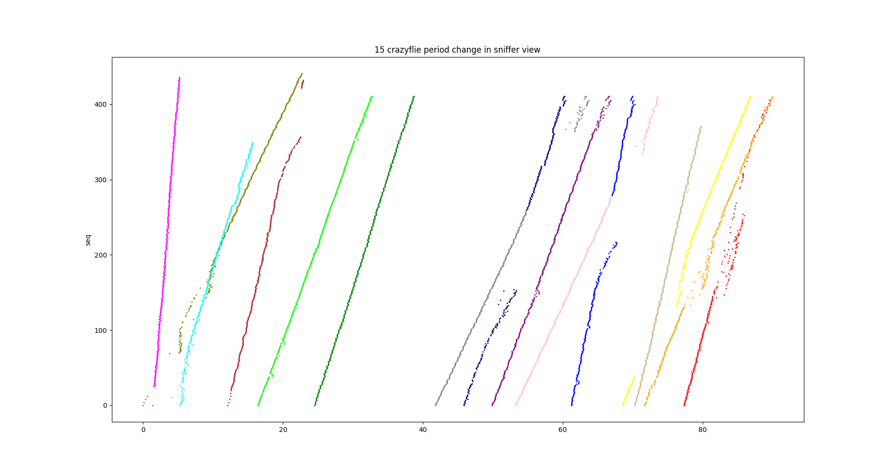

# crazyfile-simulate

分布式调度算法仿真

#周期性分布式调度算法模拟及其图像分析

1.背景介绍
信道分配方案,形式化信道分配问题。在这方面做的所有工作都是以下面 5 个关键假设为基础的。

(1)流量独立（ independent traffic ）。该模型是由 N 个独立的站（比如计算机、电话）组成的，每个站都有一个程序或者用户产生要传输的帧。

(2)单信道 ( Single Channel )。所有的通信都用这一个信道。所有的站可以在该信道上传输数据，也可以从该信道接收数据。所有站的能力都相同。

(3)时间连续（ Continuous time ）。时间是连续的，即在任何时刻都可以开始传输帧。

(4)周期性 ( Periodic )。周期性是指站每隔一段固定的时间发送一次。但是由于时钟偏差和操作系统
的影响，实际的周期可能与预期的周期有一定的误差。

2.PDSA

slotted ALOHA协议
分槽 ALOHA
ALOHA 出现不久， Roberts 发表了一种能将 ALOHA 系统的容量增加一倍的方法。
他的建议是将时间分成离散的间隔，这种时间间隔称为时间槽(slot),
每个时间槽对应于一帧。这种方法要求用户遵守统一的时间槽边界。取得同步时间的一种
办法是由一个特殊的站在每个间隔起始时发出一个脉冲信号，就好像一个时钟一样。
Roberts 方法称为分槽 ALOHA (slotted ALOHA )。与纯 ALOHA 不同的是，在分槽
ALOHA 中，站不允许用户每次敲入回车键就立即发送帧。相反，它必须要等到下一个时
槽的开始时刻。因此，连续的纯 ALOHA 变成了离散的 ALOHA ，这将易受冲突期减小了
一半。为了解清楚这点，请看图 4-3 ，并且想象现在可能发生的冲突。在测试帧所在的同一
个时间槽中没有其他流量的概率是 e^-G ，于是可以得到：
S=G*e-^G
正如你可以从图 4-3 中看到的那样，分槽 ALOHA 的尖峰在 G=l 处，此时吞吐量为
S=l/e ，大约等于 0.368 ，是纯 ALOHA 的两倍。如果系统运行在 G=l 处，则空时间槽的概
率为 0.368 （从等式（ 4-2 ）可以得出）。使用分槽 ALOHA ，我们期望的最好结果是 37% 为
空时间槽、 37%为成功，剩下 26% 为冲突。如果在更高的 G 值上运行，则空时间槽数会降
低，但冲突时间槽数会呈指数增长。为了看出冲突时间槽数是如何随着 G 的变化而快速增
长，请考虑一个测试帧的传输过程。该测试帧能够避免一次冲突的概率是 e-G ，即所有其他
用户在该时间槽中静止不发帧的概率。于是，冲突的概率为 1-e-G 。需要 k 次尝试才能成
功传输的概率（即 k-1 次冲突之后才有一次成功的概率）为：
pk =e-G (1- e-G)k-1
于是，每帧传输次数期望 E ，即终端键入一行的概率为：
E ＝五四k =Lke-G(l-e-Gt-l=eG
所以， E 随 G 呈指数增长的结果是信道负载的微小增长也会极大地降低信道的性能。

对于周期相同且固定的情况，

无人机数量为N，

周期为Period

一次发送需要的时间为T_time（在T时间内，若无人机自身在发送数据，则无法接受数据）、

一次接受需要的时间为R_time（在R时间内，若有多架无人机在发送数据，则只能接受其中一架）、

若两架无人机发送间隔小于Min_interval=max（T_time，R_time），则发生丢包。

此外，在没有调度算法的情况下，丢包会是连续性丢包

我们认为，任意无人机的初始信道是随机均匀分布的

任意两架无人机发生冲突的概率为Min_interval/Period。

1号无人机与剩下N-1架无人机冲突的期望为(N-)*Min_interval/Period，

具体多少次冲突，应该是一个正态分布

期望=(N-1)*Min_interval/ Period

方差=(N-1)*Min_interval/Period*(1-Min_interval/Period)。

对于每一架无人机 冲突发生形式相同

总期望=N*（N-1）Min_interval/Period

3.仿真

class Time 用于模拟时间，步长为0.01ms

class Crazyflie 用于模拟无人机，包含信道、周期、发送帧、接收帧等信息

class environment 用于模拟信道，一个时间内只能有一个信号
